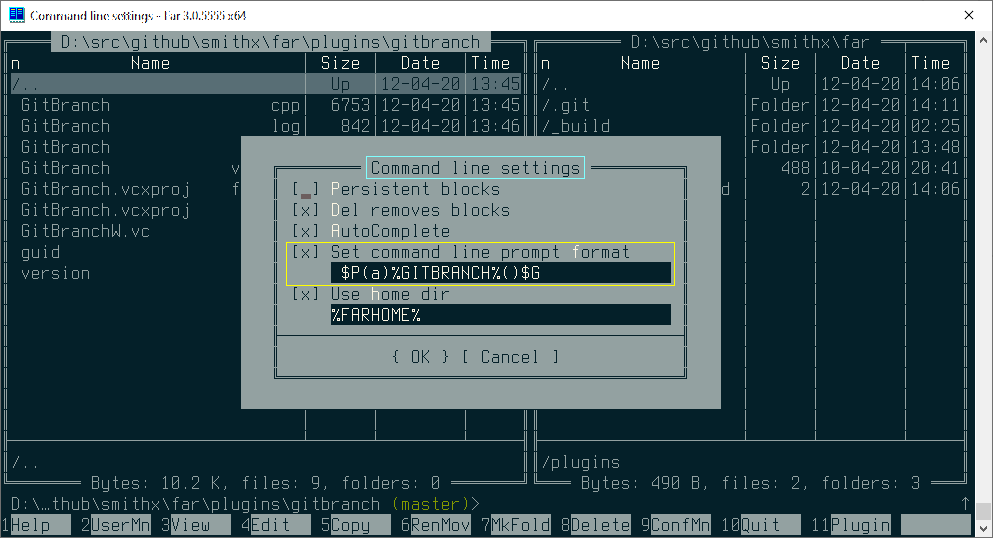

# GitBranch Far plugin

Plugin shows git branch name at command prompt area if active Far panel directory inside git repository.

Plugin setup `%GITBRANCH%` environment variable value to branch name. You should customize "Command line settings" to use `%GITBRANCH%` in command line prompt format:

After that branch name will be shown at prompt:

