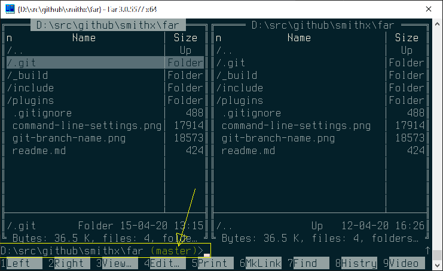

# GitBranch Far Manager plugin

Plugin helps Far Manager to show git branch at command prompt. It setups `%GITBRANCH%` to branch name for repository on active panel. You should customize "Command line settings" to insert `%GITBRANCH%` in command line prompt format string. Branch name will be shown at command prompt:

**Git is not needed**

